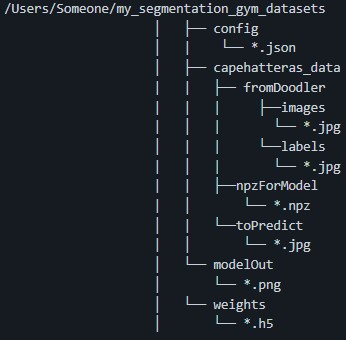

# My Feedback on [Segmentation Gym's Wiki](https://github.com/Doodleverse/segmentation_gym/wiki)!

## Home
> We take transferability seriously; Gym is designed to be a "one stop shop" for image segmentation on N-D imagery (i.e. any number of coincident bands). It is tailored to Earth Observation and aerial remote sensing imagery.
- Might just be because I'm a ML noob but what are bands?

## 2_Case Study Demo
> `capehatteras_data`: this folder contains the model training data
- Can our own training data be called something else?
- Any rules that we need to follow when labeling our own folder? camelCase, kebab_case, numbers, symbols allowed?
> `fromDoodler`: these are the images and labels made (in this case, using Doodler, but please note it is not necessary to only use Doodler to acquire label images)
- Do we need to run Doodler on our own dataset before using Gym? Or does Gym run Doodler for us?
- Do we have to create this folder or does Gym create it for us? Should this folder be empty initially?
- If we don't use Doodler (maybe because we already have some labeled images or don't have time to figure out how to use it), then what other tools can we use to acquire labeled images?
  - And will these tools provide the same files in the same format that you expect for this folder?
- Can these images be in other file formats (png, svg, heic)?
- There's an images folder inside both the images and labels folder. Is that necessary in order to run Gym?
- Do the names of the jpg files in the `C:\Users\Someone\my_segmentation_gym_datasets\capehatteras_data\fromDoodler\images\images` folder have to match the names of the jpg files in the `C:\Users\Someone\my_segmentation_gym_datasets\capehatteras_data\fromDoodler\labels\images` folder?
- Is it normal that the labeled images are all black in the provided sample data?
> `npzForModel`: these are the npz files made by running the Gym script `make_nd_dataset.py`
- Do we have to run this Gym script before we start? Or are we going to run this in a later step?
- Do we have to create this folder or does Gym create it for us? Should this folder be empty initially?
- The provided folder structure doesn't contain the `aug_sample` and `noaug_sample` folders that were provided in the sample data. Do we need those?\

> `toPredict`: these are sample images that you'd like to segment
- Is the `out` folder supposed to be in this folder in the beginning?
- First step is to put our own dataset images in this folder, right?
- Can these images be in other file formats (png, svg, heic)?
> `modelOut`: this folder contains files to demonstrate model performance. These files are written by `train_model.py` after model training, and consist of some validation sample images with a semi-transparent color overlay depicting the image segmentation.
- I was looking at the images in this folder and there's terms like `dice` and `kl=inf`. What do they mean?
- Do we have to create this folder or does Gym create it for us? Should this folder be empty initially?
> `weights`: this folder contains model weight files in h5 format. These files are written by `train_model.py` during model training.
- Just wanted to say that it’s super helpful that I get to see what script from Gym creates which files!
- Would we ever need to view the h5 files? How do you open them?
- Do we have to create this folder or does Gym create it for us? Should this folder be empty initially?
### Test a model
- Under this heading, I feel like it would be a good reminder to include a link to the [installation instructions](https://github.com/Doodleverse/segmentation_gym#%EF%B8%8F-installation) in case users accidentally skipped cloning or creating a conda environment.
  - My GitHub issue for installing dependencies with `conda` instead of `yml` is detailed [here](https://github.com/Doodleverse/segmentation_gym/issues/78).
- Before telling users to run `python seg_images_in_folder.py`, it would also be nice to remind CPU users to check if `"SET_GPU": "-1"` is in the config file for the model that they want to test.
  - I forgot to do that so I was trying to abort with `Ctrl C`, but the model was already running on the sample images.
  - There were a total of 129 images in `C:\Users\Someone\my_segmentation_gym_datasets\capehatteras_data\toPredict`, so I was pressing `Ctrl C` for each of the images until I realized I could've just closed the whole terminal to start over.😅
> Next, you will be asked to select the weights file, e.g. `C:\Users\Someone\my_segmentation_gym_datasets\weights\hatteras_l8_resunet.h5`. It is set up for ensemble modeling, where your ensemble of models would differ based on config settings. When you are prompted to add more weights files, say 'No'. It will just load and use one model
- So each h5 file represents a model?
- Can we add our own h5 file to test our own model?
> In the folder of images that you specified, there should be a new subfolder called `out` that contains model outputs, e.g. `C:\Users\Someone\my_segmentation_gym_datasets\capehatteras_data\toPredict\out`. These png format files show sample images with a semi-transparent color overlay depicting the image segmentation.
- I feel like the `out` folder in the sample dataset should be renamed to something like `sample_out` so when the user runs the model on the sample data, there's no errors due to Gym wanting to create a new folder with the same name of an existing `out` folder.
- What model was used for the provided output? Maybe we can state this somewhere for users to run the same model and compare their own outputs to the ones that were provided.
- I like that you included some terminal outputs! It helps me know if I'm getting the expected results.
### Train a ResUNet model from scratch
