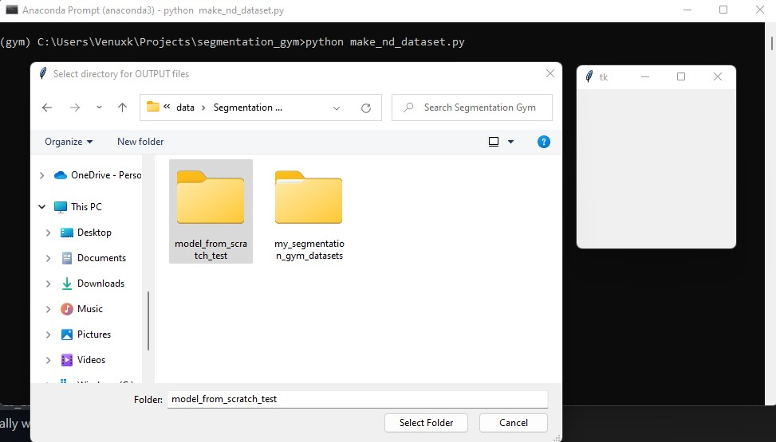

# My Feedback on [Segmentation Gym's Wiki](https://github.com/Doodleverse/segmentation_gym/wiki)!
Note: I figure out answers to some of my questions as I go through the rest of the Wiki, but I still included those questions since it's good to tell users what to expect ahead of time to avoid confusion.

## [Home](https://github.com/Doodleverse/segmentation_gym/wiki)
> We take transferability seriously; Gym is designed to be a "one stop shop" for image segmentation on N-D imagery (i.e. any number of coincident bands). It is tailored to Earth Observation and aerial remote sensing imagery.
- Might just be because I'm a ML noob but what are bands?

## [2_Case Study Demo](https://github.com/Doodleverse/segmentation_gym/wiki/2_Case-Study-Demo)
> `capehatteras_data`: this folder contains the model training data
- Can our own training data be called something else?
- Any rules that we need to follow when labeling our own folder? camelCase, kebab_case, numbers, symbols allowed?
> `fromDoodler`: these are the images and labels made (in this case, using Doodler, but please note it is not necessary to only use Doodler to acquire label images)
- Do we need to run Doodler on our own dataset before using Gym? Or does Gym run Doodler for us?
- Do we have to create this folder or does Gym create it for us? Should this folder be empty initially?
- If we don't use Doodler (maybe because we already have some labeled images or don't have time to figure out how to use it), then what other tools can we use to acquire labeled images?
  - And will these tools provide the same files in the same format that you expect for this folder?
- Can these images be in other file formats (png, svg, heic)?
- There's an `images` folder inside both the `images` and `labels` folder, and inside that `images` folder contains another `images` folder with jpeg images. Is nesting the folders necessary in order to run Gym?
- Do the names of the jpg files in the `C:\Users\Someone\my_segmentation_gym_datasets\capehatteras_data\fromDoodler\images\images\images` folder have to match the names of the jpg files in the `C:\Users\Someone\my_segmentation_gym_datasets\capehatteras_data\fromDoodler\labels\images\images` folder?
- Is it normal that the labeled images are all black in the provided sample data?
> `npzForModel`: these are the npz files made by running the Gym script `make_nd_dataset.py`
- Do we have to run this Gym script before we start? Or are we going to run this in a later step?
- Do we have to create this folder or does Gym create it for us? Should this folder be empty initially?
- The provided folder structure doesn't contain the `aug_sample` and `noaug_sample` folders that were provided in the sample data. Do we need those?\

> `toPredict`: these are sample images that you'd like to segment
- Is the `out` folder supposed to be in this folder in the beginning?
- First step is to put our own dataset images in this folder, right?
- Can these images be in other file formats (png, svg, heic)?
> `modelOut`: this folder contains files to demonstrate model performance. These files are written by `train_model.py` after model training, and consist of some validation sample images with a semi-transparent color overlay depicting the image segmentation.
- I was looking at the images in this folder and there's terms like `dice` and `kl=inf`. What do they mean?
- Do we have to create this folder or does Gym create it for us? Should this folder be empty initially?
> `weights`: this folder contains model weight files in h5 format. These files are written by `train_model.py` during model training.
- Just wanted to say that it’s super helpful that I get to see what script from Gym creates which files!
- Would we ever need to view the h5 files? How do you open them?
- Do we have to create this folder or does Gym create it for us? Should this folder be empty initially?
> ### [Test a model](https://github.com/Doodleverse/segmentation_gym/wiki/2_Case-Study-Demo#test-a-model)
- Under this heading, I feel like it would be a good reminder to include a link to the [installation instructions](https://github.com/Doodleverse/segmentation_gym#%EF%B8%8F-installation) in case users accidentally skipped cloning or creating a conda environment.
  - My GitHub issue for installing dependencies with `conda` instead of `yml` is detailed [here](https://github.com/Doodleverse/segmentation_gym/issues/78).
- Before telling users to run `python seg_images_in_folder.py`, it would also be nice to remind CPU users to check if `"SET_GPU": "-1"` is in the config file for the model that they want to test.
  - I forgot to do that so I was trying to abort with `Ctrl C`, but the model was already running on the sample images.
  - There were a total of 129 images in `C:\Users\Someone\my_segmentation_gym_datasets\capehatteras_data\toPredict`, so I was pressing `Ctrl C` for each of the images until I realized I could've just closed the whole terminal to start over.😅
> Next, you will be asked to select the weights file, e.g. `C:\Users\Someone\my_segmentation_gym_datasets\weights\hatteras_l8_resunet.h5`. It is set up for ensemble modeling, where your ensemble of models would differ based on config settings. When you are prompted to add more weights files, say 'No'. It will just load and use one model
- So each h5 file represents a model?
- Can we add our own h5 file to test our own model?
> In the folder of images that you specified, there should be a new subfolder called `out` that contains model outputs, e.g. `C:\Users\Someone\my_segmentation_gym_datasets\capehatteras_data\toPredict\out`. These png format files show sample images with a semi-transparent color overlay depicting the image segmentation.
- I feel like the `out` folder in the sample dataset should be renamed to something like `sample_out` so when the user runs the model on the sample data, there's no errors due to Gym wanting to create a new folder with the same name of an existing `out` folder.
- What model was used for the provided output? Maybe we can state this somewhere for users to run the same model and compare their own outputs to the ones that were provided.
- I like that you included some terminal outputs! It helps me know if I'm getting the expected results.
> ### [Train a ResUNet model from scratch](https://github.com/Doodleverse/segmentation_gym/wiki/2_Case-Study-Demo#train-a-resunet-model-from-scratch)
> Step 2: from your `segmentation_gym` root folder, e.g. `/Users/Someone/github_clones/segmentation_gym`, in an activated `gym` conda environment, run `python make_nd_dataset.py`.
- What is the purpose of this step? How does Gym use the outputted npz files?
- There's an extra popup (see right popup in the image below) that appears at each step for me. I don't think it's supposed to be there.

- It appears behind the popups that prompt users to choose a folder though, so this tiny issue can be addressed later.
> - Select a folder of labels in jpeg format e.g. `/Users/Someone/my_segmentation_gym_datasets/capehatteras_data/fromDoodler/labels`
> - Select a folder of images in jpeg format e.g. `/Users/Someone/my_segmentation_gym_datasets/capehatteras_data/fromDoodler/images`
- There's a nested `images` folder containing jpeg images inside the `labels/images` and `images/images` folders. Should we choose the `/Users/Someone/my_segmentation_gym_datasets/capehatteras_data/fromDoodler/labels/images/images` and `/Users/Someone/my_segmentation_gym_datasets/capehatteras_data/fromDoodler/images/images/images` folder instead for the prompts? 
> It will create new files inside your output folder, e.g. `/Users/Someone/model_from_scratch_test`; `npz` format files contain all the `aug` and `noaug` image:label pairs. A subset of augmented and non-augmented image-label overlays are created inside `aug_sample` and `noaug_sample` folders, respectively.
- Why only a subset of image-label overlays are created? How were they chosen?
- How do we open npz files? I'm just curious how the image-to-label pairs look like.
> When the model is finished training, it will evaluate on the test set:
> ```
> Evaluating model on entire validation set ...
> 20/20 [==============================] - 4s 180ms/step - loss: 0.0213 - mean_iou: 0.9843 - dice_coef: 0.9787
> loss=0.0213, Mean IOU=0.9843, Mean Dice=0.9787
> Mean of mean IoUs (validation subset)=0.985
> Mean of mean Dice scores (validation subset)=0.979
> Mean of mean IoUs (train subset)=0.990
> Mean of mean Dice scores (train subset)=0.984
> ```
- What is loss, IoU, and Dice?
> Model training results in the following new files inside your `weights` directory e.g. `/Users/Someone/my_segmentation_gym_datasets/weights/`
> - `hatteras_l8_resunet.h5`: this is
> - `hatteras_l8_resunet_fullmodel.h5`: this is
> - `hatteras_l8_resunet_model_history.npz`: this is
> - `hatteras_l8_resunet_train_files.txt`: this is
> - `hatteras_l8_resunet_val_files.txt`: this is
- <mark>Need to finish describing each file.</mark>

## [3_Directory Structure and Tests](https://github.com/Doodleverse/segmentation_gym/wiki/3_Directory-Structure-and-Tests)
> The `weights`, `npz4gym`, and `modelOut` directories should be left empty - they will be populated with files by running Gym programs, as explained below.
- `npz4gym` seems to be used on this page, while `npzForModel` is used for the [second wiki page](https://github.com/Doodleverse/segmentation_gym/wiki/2_Case-Study-Demo). We should make sure all the pages use the same name for that folder.
- I just going to modify all `npz4gym` occurences to `npzForModel` so that it matches the sample dataset's structure.

## [4_Creation of `config` files](https://github.com/Doodleverse/segmentation_gym/wiki/4_Creation-of-%60config%60-files)
> The model consists of the `config` file, the `.h5` weights file, and the code that executes the model. Inside this repository, that code is called `seg_images_in_folder.py` but is just one form of relatively simple implementation of basic trained model or sensemble of trained models. Further implementation.
- Were you going to talk about "Further implementation" but just forgot to?
> `LOSS`: one of `cat` (categorical cross-entropy), `dice` (Dice loss), `hinge` (hinge loss), or `kld` (Kullback-Leibler divergence)
- Is `LOSS` an optional training configuration since it's not in the sample config file?
- Super helpful to explain each configuration in the example!

## [5_Create a model ready dataset](https://github.com/Doodleverse/segmentation_gym/wiki/5_Create-a-model-ready-dataset)
- This page gives great context to what `make_nd_dataset.py` does!!! We should include a link this page in the [case study page](https://github.com/Doodleverse/segmentation_gym/wiki/2_Case-Study-Demo#train-a-resunet-model-from-scratch).
  - My suggested edit:
    > Step 2: from your `segmentation_gym` root folder, e.g. `/Users/Someone/github_clones/segmentation_gym`, in an activated `gym` conda environment, run `python make_nd_dataset.py` to [create a model-ready dataset](https://github.com/Doodleverse/segmentation_gym/wiki/5_Create-a-model-ready-dataset).
> Run `make_dataset.py`
- The file is currently named `make_nd_dataset.py`, so I edited this part to match the current name.
- What does `nd` stand for?

## [6_Models in Gym](https://github.com/Doodleverse/segmentation_gym/wiki/6_Models-in-Gym)
> ### [The UNet family of models](https://github.com/Doodleverse/segmentation_gym/wiki/6_Models-in-Gym#the-unet-family-of-models)
> ...\
> The UNet framework consists of two parts, the encoder and the decoder. The encoder receives the input image and applies a series of convolutional and batch normalization layers, and optionally Dropout layers, followed by pooling layers that reduce the spatial size and condense features. Four banks of convolutional filters each use filters that double in size to the previous, thereby progressively downsampling the inputs as features are extracted through pooling. The last set of features (or so-called bottleneck) is a very low-dimensional feature representation of the input imagery. The decoder upsamples the bottleneck into a label image progressively using convolutional filters, each using filters half in size to the previous, thereby progressively upsampling the inputs as features are extracted through transpose convolutions and concatenation. The sets of features from each of the four levels in the encoder-decoder structure are concatenated, which allows learning different features at different levels and leads to spatially well-resolved outputs. The final classification layer maps the output of the previous layer to a single 2D output based on a sigmoid activation function.
> ### [UNet model](https://github.com/Doodleverse/segmentation_gym/wiki/6_Models-in-Gym#unet-model)
> ...\
> The fully convolutional model framework consists of two parts, the encoder and the decoder. The encoder receives the N x N x M (M=1, 3 or 4 in this implementation) input image and applies a series of convolutional layers and pooling layers to reduce the spatial size and condense features. Six banks of convolutional filters, each using filters that double in size to the previous, thereby progressively downsampling the inputs as features are extracted through pooling. The last set of features (or so-called bottleneck) is a very low-dimensional feature representation of the input imagery. The decoder upsamples the bottleneck into a N x N x 1 label image progressively using six banks of convolutional filters, each using filters half in size to the previous, thereby progressively upsampling the inputs as features are extracted through transpose convolutions and concatenation. A transposed convolution convolves a dilated version of the input tensor, consisting of interleaving zeroed rows and columns between each pair of adjacent rows and columns in the input tensor, in order to upscale the output. The sets of features from each of the six levels in the encoder-decoder structure are concatenated, which allows learning different features at different levels and leads to spatially well-resolved outputs. The final classification layer maps the output of the previous layer to a single 2D output based on a sigmoid activation function.
- These two sections have information that repeat. Perhaps mixing them together and putting it under one of the sections is better.
> ### [Residual UNet model](https://github.com/Doodleverse/segmentation_gym/wiki/6_Models-in-Gym#residual-unet-model)
> 
- The `res-unet-diagram` is missing.

## [7_Train an image segmentation model](https://github.com/Doodleverse/segmentation_gym/wiki/7_Train-an-image-segmentation-model)
> :warning: :no_pedestrians:\
> *Note*: you require an NVIDIA GPU with >6GB memory to train models from scratch using a GPU\
> The following instructions assume you have already run `make_datasets` to create .npz format files that contain all your data for model training and validation.
- So that's probably why my laptop (CPU) was freezing and shut down when I was trying to follow the instructions for [training a ResUnet model from scratch](https://github.com/Doodleverse/segmentation_gym/wiki/2_Case-Study-Demo#train-a-resunet-model-from-scratch)...
- I renamed `make_datasets` to match the current name (`make_nd_dataset.py`) again.

## [8_Case study 2](https://github.com/Doodleverse/segmentation_gym/wiki/8_Case-study-2)
- Very nice to break down another `config` file into explainable bits! 👍
> ### [Case Study](https://github.com/Doodleverse/segmentation_gym/wiki/8_Case-study-2#case-study)
> We have 114 images and corresponding label images of flooded streets and channels. Imagery is provided by Dr Jenna Brown, USGS MD-DE-DC Water Science Center\
> ...
> ### [Model evaluation](https://github.com/Doodleverse/segmentation_gym/wiki/8_Case-study-2#model-evaluation)
> ...\
> Next, we evaluate the skill of the model visually on a hold-out sample of 17 images in the `holdOutSet` folder.
- Can you provide a `zip` file of the images for this case study? I'm not exactly sure where to get the images and which 17 to put in the `holdOutSet` folder.
> ### [File organization](https://github.com/Doodleverse/segmentation_gym/wiki/8_Case-study-2#file-organization)
> We organize our files like this, putting `jpg` format images and greyscale label images into the `images` and `labels` folders, respectively. The config file goes in `config`. The `holdOutSet` folder is for `jpg` format images and is optional. The `weights`, `npz4gym`, and `modelOut` directories should be left empty - they will be populated with files by running Gym programs, as explained below.
- I just renamed all the `npz4gym` occurences again to `npzForModel` so that it matches the sample dataset for the [first case study](https://github.com/Doodleverse/segmentation_gym/wiki/2_Case-Study-Demo).
> ### [Dataset creation](https://github.com/Doodleverse/segmentation_gym/wiki/8_Case-study-2#dataset-creation)
> When we run `python make_nd_dataset.py`. First, choose a directory to store the output files. In this example, this is the folder we created called `npzForModel`. Next, choose the `config` file, then the directory of labels, then the images. Finally, you will be asked for 
- <mark>Need to finish the last sentence.</mark>